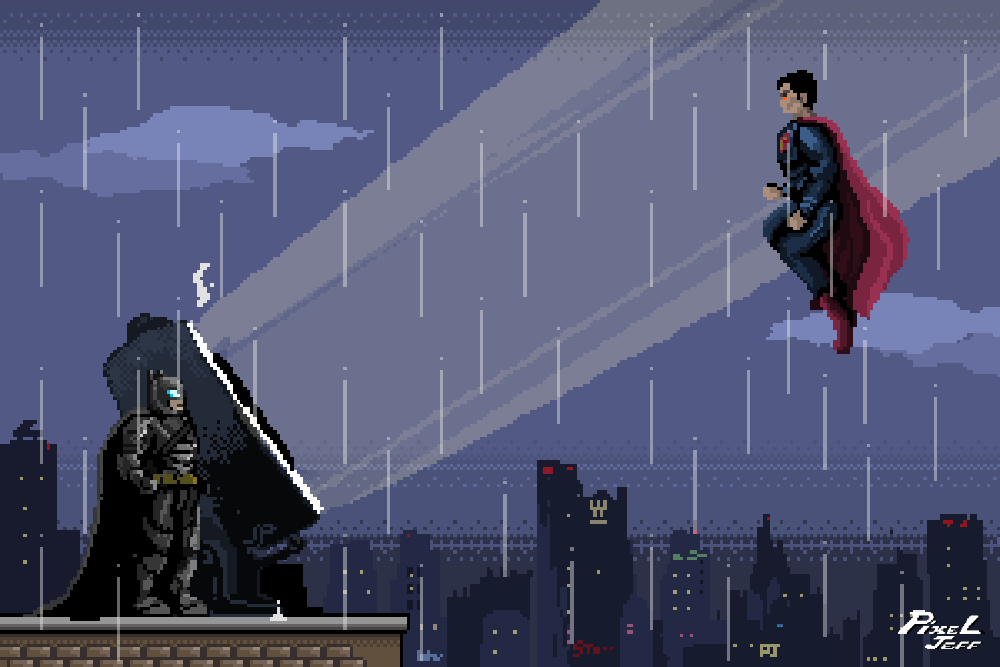

<p align="center">
  
</p>

## 📌 About Me

```typescript
const Ishan = {
    location: "India 🇮🇳",

    currentlyLearning: [
        "Backend Development",
        "System Design",
        "AI Integration"
    ],

    building: [
        "Full Stack Applications",
        "AI-Powered Projects",
        "Scalable Web Applications"
    ],

    interests: [
        "Machine Learning Systems",
        "Real-World Problem Solving",
        "Production-Grade Backend Architecture",
    ],

    collaboration: [
        "Open Source Projects",
        "AI Projects",
        "MERN Stack Applications"
    ],
    
    currentGoal:
        "Becoming a strong software engineer capable of building end-to-end products",

    funFact:
        "I spend more time fixing bugs than writing features 😄"
};

```

## 📊 GitHub Stats & Trophies
<p align="center">
  <a href="https://github.com/ishanbhardwaj17">
    
  </a>
  
</p>
<div align="center">
  
</div>


## 🛠️ Languages & Tools

<h3 align="center">Programming Languages</h3>
<p align="center">
  &nbsp;
  &nbsp;
  &nbsp;
  

</p>

<h3 align="center">Frontend</h3>
<p align="center">
  &nbsp;
  &nbsp;
  &nbsp;
  &nbsp;
  

</p>

<h3 align="center">Backend</h3>
<p align="center">
  &nbsp;
  &nbsp;
  &nbsp;
  &nbsp;
  &nbsp;
  

</p>

<h3 align="center">Database</h3>
<p align="center">
  &nbsp;
  &nbsp;
  &nbsp;
  &nbsp;
  

</p>

<h3 align="center">DevOps & Cloud</h3>
<p align="center">
  &nbsp;
  &nbsp;
  &nbsp;
  &nbsp;
  

</p>

<h3 align="center">Tools</h3>
<p align="center">
  &nbsp;
  &nbsp;
  &nbsp;
  &nbsp;
  &nbsp;
  

</p>

## 🔗 Connect with Me
<p align="center">
  <a href="https://www.linkedin.com/in/ishan-bhardwaj-a484ab329/">
    
  </a>&nbsp;&nbsp;&nbsp;&nbsp;&nbsp;
  <a href="https://wa.me/9108824895152">
    
  </a>&nbsp;&nbsp;&nbsp;&nbsp;&nbsp;
  <a href="mailto:ISHANBHARDWAJ177@GMAIL.COM">
    
  </a>
</p>

<p align="center">
  
</p>

<p align="center">
  <a href="https://komarev.com/ghpvc/?username=ishanbhardwaj17">
    
  </a>
</p>

<div align="center">
  
</div>

